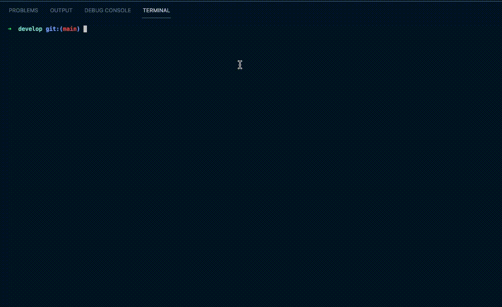

# Social Network API

## Description

This project is an API for a social network web application where users can share their thoughts, react to friends’ thoughts, and create a friend list. This project uses Express.js for routing, a MongoDB database, and the Mongoose ODM.

## Table of Contents

- [Installation](#installation)
- [Usage](#usage)
- [License](#license)
- [Contributing](#contributing)
- [Testing](#testing)
- [Questions](#questions)

## Installation

Clone the repository, run `npm i` to install the dependencies, `npm run seed` to seed the database, and `npm run start` to launch to server. You can see a walkthrough video of initializing the app below:

## Usage

This application is not deployed to the web, so you will have to follow the installation instructions above in order to use it for yourself. Otherwise, you can see walk through videos of testing in insomnia below:

You can also view all three videos [here](https://drive.google.com/drive/folders/1HWpC25YkR-_FqQpN5fwbGQdjNFJpcL_A?usp=sharing)

## License

This application is covered under the MIT license.

## Contributing

Adhere to the contributing covenant.

## Testing

With Insomnia

## Questions

If you have any questions, please feel free to contact me via:

- Github: [chighum](https://github.com/chighum)
- Email: [chighum41@gmail.com](mailto:chighum41@gmail.com)
